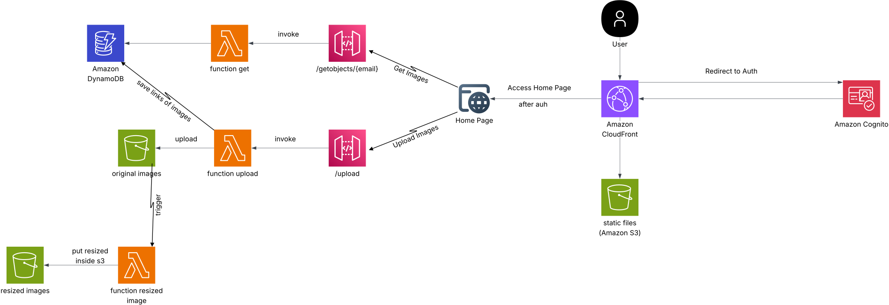

# AWS Serverless Image Processing Application

A comprehensive serverless image processing application built on AWS that provides user authentication, secure image upload, automatic image resizing, and a responsive web interface.

##  Architecture Overview



This application leverages multiple AWS services to create a scalable, secure, and cost-effective image processing solution:

- **Frontend**: Static website hosted on S3 and delivered via CloudFront
- **Authentication**: AWS Cognito for user management and authentication
- **API**: API Gateway with Lambda functions for backend operations
- **Storage**: S3 buckets for source images, processed images, and Lambda code
- **Processing**: Lambda function for automatic image resizing
- **Database**: DynamoDB for user data and image metadata
- **CDN**: CloudFront for global content delivery

## 🚀 Features

- ✅ **User Authentication**: Secure user registration and login via AWS Cognito
- ✅ **Image Upload**: Secure file upload through API Gateway and Lambda
- ✅ **Automatic Processing**: Triggered image resizing when files are uploaded
- ✅ **Multiple Formats**: Support for various image formats (configurable)
- ✅ **Responsive UI**: Modern web interface with CORS support
- ✅ **Scalable Storage**: Separate buckets for original and processed images
- ✅ **Global CDN**: Fast content delivery worldwide via CloudFront
- ✅ **Secure Access**: IAM roles and policies for least-privilege access
- ✅ **Monitoring**: CloudWatch logs for debugging and monitoring


## 🛠️ AWS Services Used

### Core Services
- **S3**: Object storage for images and static website hosting
- **Lambda**: Serverless compute for image processing and API operations
- **API Gateway**: RESTful API endpoints
- **CloudFront**: Content Delivery Network
- **Cognito**: User authentication and authorization
- **DynamoDB**: NoSQL database for user and image metadata
- **IAM**: Identity and access management

### Supporting Services
- **CloudWatch**: Logging and monitoring

## 🚀 Deployment Guide

### Step 1: Clone and Prepare

```bash
git clone https://github.com/amoghazy/manara-SAA
cd  manara-SAA
```

### Step 2: Package Lambda Functions

```bash
# Package Python image processor
cd lambda-code-image-resize-build
run commnad in command-zip-codepy.sh
move zip folder inside terraform code
cd ..

# Node.js functions are auto-packaged by Terraform
```

### Step 3: Deploy Infrastructure

```bash
cd terraform
terraform init
terraform plan
terraform apply
```

### Step 4: Access Your Application

After deployment, Terraform will output the website URL:

```bash
terraform output website_url
```

## 📊 Resource Details

### S3 Buckets
- **Source Bucket**: Stores original uploaded images
- **Destination Bucket**: Stores processed/resized images (publicly readable)
- **Code Bucket**: Stores Lambda deployment packages
- **Static Website Bucket**: Hosts the web application

### Lambda Functions
- **Image Processor**: Python 3.9, 512MB memory, 180s timeout
- **Upload Function**: Node.js 20.x for handling file uploads
- **Get Objects Function**: Node.js 20.x for retrieving user images

### API Endpoints
- `POST /upload`: Upload images
- `GET /getobjects/{email}`: Retrieve user's images
- `OPTIONS /*`: CORS preflight support

##  Cleanup

To avoid ongoing AWS charges, destroy the infrastructure when no longer needed:

```bash
terraform destroy
```

**Note**: Ensure S3 buckets are empty before destroying, as Terraform cannot delete buckets containing objects.
